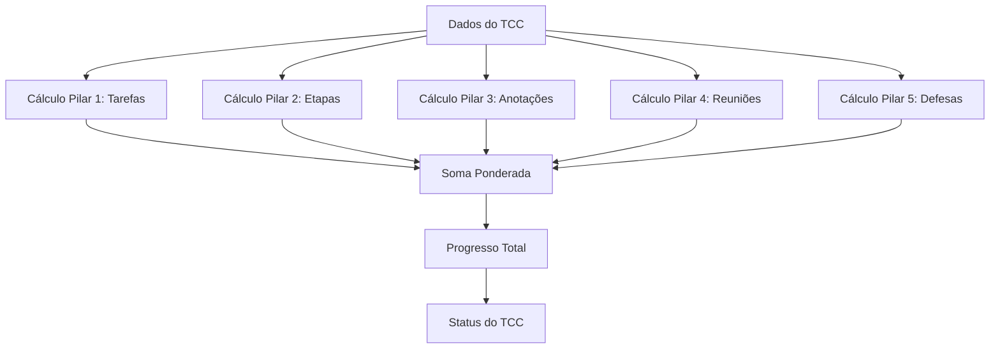

# Algoritmo de Cálculo de Progresso do TCC

## 📋 Índice
- [Visão Geral](#visão-geral)
- [Arquitetura do Sistema](#arquitetura-do-sistema)
- [Os Cinco Pilares](#os-cinco-pilares)
- [Implementação Técnica](#implementação-técnica)
- [Exemplos Práticos](#exemplos-práticos)
- [API Endpoints](#api-endpoints)
- [Configuração e Personalização](#configuração-e-personalização)
- [Casos de Uso](#casos-de-uso)

---

## 📊 Visão Geral

O **Algoritmo de Cálculo de Progresso do TCC** é um sistema multidimensional desenvolvido para avaliar o avanço do Trabalho de Conclusão de Curso de forma holística e precisa. O algoritmo baseia-se em cinco pilares fundamentais que representam diferentes aspectos do desenvolvimento acadêmico.

### Objetivos Principais
- Fornecer uma visão 360° do progresso do TCC
- Equilibrar diferentes aspectos do desenvolvimento acadêmico
- Permitir acompanhamento granular por orientadores
- Incentivar práticas acadêmicas saudáveis
- Facilitar a identificação de áreas que necessitam atenção

### Características Técnicas
- **Tipo**: Sistema de pontuação ponderada
- **Escala**: 0% a 100%
- **Componentes**: 5 pilares independentes
- **Atualização**: Tempo real
- **Flexibilidade**: Pesos configuráveis

---

## 🏗️ Arquitetura do Sistema

### Distribuição de Pesos
```
Progresso Total = Σ(Pilar × Peso)
```

| Pilar | Peso | Justificativa |
|-------|------|---------------|
| Tarefas/Atividades | 30% | Representa o trabalho prático e operacional |
| Etapas do Projeto | 30% | Marcos estruturais e metodológicos |
| Anotações | 10% | Documentação e reflexão contínua |
| Reuniões | 10% | Acompanhamento orientativo |
| Defesas | 20% | Avaliações formais e marcos definitivos |

### Fluxo de Cálculo


---

## 🎯 Os Cinco Pilares

### 1️⃣ Pilar 1: Tarefas e Atividades (30%)

**Descrição**: Avalia o progresso baseado na conclusão de atividades específicas cadastradas no sistema.

**Fórmula**:
```
Progresso_Tarefas = (Atividades_Concluídas ÷ Total_Atividades) × 30%
```

**Critérios**:
- Status considerado: `CONCLUIDA`
- Tipos de atividade: Todas as atividades cadastradas
- Tratamento especial: Retorna 0% se não há atividades cadastradas

**Exemplos de Atividades**:
- Pesquisa bibliográfica
- Elaboração de capítulos
- Coleta de dados
- Análise de resultados
- Revisões e correções

### 2️⃣ Pilar 2: Etapas do Projeto (30%)

**Descrição**: Considera os marcos maiores e estruturais do desenvolvimento do TCC.

**Fórmula**:
```
Progresso_Etapas = (Etapas_Concluídas ÷ Total_Etapas) × 30%
```

**Critérios**:
- Status considerado: `CONCLUIDA`
- Natureza: Marcos estruturais significativos
- Tratamento especial: Retorna 0% se não há etapas cadastradas

**Exemplos de Etapas**:
- Revisão Bibliográfica
- Desenvolvimento da Metodologia
- Implementação/Experimentação
- Análise de Resultados
- Finalização e Revisão

### 3️⃣ Pilar 3: Anotações (10%)

**Descrição**: Valoriza a documentação contínua e reflexiva do processo de pesquisa.

**Fórmula**:
```
Progresso_Anotações = min(Quantidade_Anotações ÷ 10, 1) × 10%
```

**Critérios**:
- Referência: 10 anotações = 100% da pontuação
- Limite: Máximo de 10% mesmo com mais anotações
- Natureza: Qualquer anotação cadastrada no sistema

**Tipos de Anotações**:
- Insights de pesquisa
- Reflexões metodológicas
- Descobertas importantes
- Anotações de orientação
- Registros de progresso

### 4️⃣ Pilar 4: Reuniões (10%)

**Descrição**: Avalia o cumprimento do acompanhamento orientativo regular.

**Fórmula**:
```
Progresso_Reuniões = (Reuniões_Realizadas ÷ Reuniões_Agendadas) × 10%
```

**Critérios**:
- Status considerado: `REALIZADA`
- Base de cálculo: Reuniões agendadas
- Tratamento especial: Retorna 0% se não há reuniões agendadas

**Tipos de Reuniões**:
- Orientações regulares
- Reuniões de alinhamento
- Sessões de feedback
- Reuniões de emergência
- Apresentações parciais

### 5️⃣ Pilar 5: Defesas (20%)

**Descrição**: Representa os momentos formais de avaliação do trabalho.

**Estrutura Binária**:
- **Pré-banca**: 10% (quando realizada)
- **Banca Final**: 10% (quando realizada)

**Fórmula**:
```
Progresso_Defesas = (Pré-banca_Realizada × 10%) + (Banca_Final_Realizada × 10%)
```

**Critérios**:
- Status considerado: `REALIZADA`
- Tipos: `PRE_BANCA` e `BANCA_FINAL`
- Natureza: Sistema tudo-ou-nada (0% ou pontuação completa)

---

## 💻 Implementação Técnica

### Estrutura de Dados

```typescript
interface ProgressoCalculado {
  progresso_tarefas: number;    // 0-30
  progresso_etapas: number;     // 0-30
  progresso_anotacoes: number;  // 0-10
  progresso_reunioes: number;   // 0-10
  progresso_defesas: number;    // 0-20
  progresso_total: number;      // 0-100
}
```

### Constantes Configuráveis

```typescript
const PESO_TAREFAS = 30;                // Peso das tarefas
const PESO_ETAPAS = 30;                 // Peso das etapas
const PESO_ANOTACOES = 10;              // Peso das anotações
const PESO_REUNIOES = 10;               // Peso das reuniões
const PESO_DEFESAS = 20;                // Peso das defesas
const MIN_ANOTACOES_COMPLETAS = 10;     // Mínimo para 100% das anotações
```

### Função Principal

```typescript
function calcularProgressoCompleto(tcc: TCCCompleto): ProgressoCalculado {
    // Implementação dos 5 pilares
    const progresso_tarefas = calcularProgressoTarefas(tcc.Atividades);
    const progresso_etapas = calcularProgressoEtapas(tcc.EtapasTCC);
    const progresso_anotacoes = calcularProgressoAnotacoes(tcc.Anotacoes);
    const progresso_reunioes = calcularProgressoReunioes(tcc.Reunioes);
    const progresso_defesas = calcularProgressoDefesas(tcc.Defesas);
    
    const progresso_total = progresso_tarefas + progresso_etapas + 
                           progresso_anotacoes + progresso_reunioes + 
                           progresso_defesas;
    
    return {
        progresso_tarefas,
        progresso_etapas,
        progresso_anotacoes,
        progresso_reunioes,
        progresso_defesas,
        progresso_total
    };
}
```

### Tratamento de Casos Especiais

```typescript
// Proteção contra divisão por zero
const progresso_tarefas = totalTarefas > 0 ? 
    (tarefasConcluidas / totalTarefas) * PESO_TAREFAS : 0;

// Limitação de valores máximos
const progresso_anotacoes = Math.min(
    (qtdAnotacoes / MIN_ANOTACOES_COMPLETAS), 1
) * PESO_ANOTACOES;

// Verificação de existência de dados
if (!tcc.Atividades?.length) {
    return { progresso_tarefas: 0 };
}
```

---

## 📈 Exemplos Práticos

### Exemplo 1: TCC em Desenvolvimento Inicial

**Dados**:
- Tarefas: 2 concluídas de 10 totais
- Etapas: 1 concluída de 5 totais
- Anotações: 3 registradas
- Reuniões: 1 realizada de 2 agendadas
- Defesas: Nenhuma realizada

**Cálculo**:
```
Tarefas: (2/10) × 30% = 6%
Etapas: (1/5) × 30% = 6%
Anotações: (3/10) × 10% = 3%
Reuniões: (1/2) × 10% = 5%
Defesas: 0 × 20% = 0%

Progresso Total: 6% + 6% + 3% + 5% + 0% = 20%
Status: "Em Andamento"
```

### Exemplo 2: TCC Avançado

**Dados**:
- Tarefas: 8 concluídas de 10 totais
- Etapas: 4 concluídas de 5 totais
- Anotações: 12 registradas
- Reuniões: 5 realizadas de 6 agendadas
- Defesas: Pré-banca realizada

**Cálculo**:
```
Tarefas: (8/10) × 30% = 24%
Etapas: (4/5) × 30% = 24%
Anotações: min(12/10, 1) × 10% = 10%
Reuniões: (5/6) × 10% = 8.33%
Defesas: 1 × 10% = 10%

Progresso Total: 24% + 24% + 10% + 8.33% + 10% = 76.33%
Status: "Em Andamento"
```

### Exemplo 3: TCC Concluído

**Dados**:
- Tarefas: 10 concluídas de 10 totais
- Etapas: 5 concluídas de 5 totais
- Anotações: 15 registradas
- Reuniões: 8 realizadas de 8 agendadas
- Defesas: Ambas realizadas

**Cálculo**:
```
Tarefas: (10/10) × 30% = 30%
Etapas: (5/5) × 30% = 30%
Anotações: min(15/10, 1) × 10% = 10%
Reuniões: (8/8) × 10% = 10%
Defesas: (1+1) × 10% = 20%

Progresso Total: 30% + 30% + 10% + 10% + 20% = 100%
Status: "Concluído"
```

---

## 🚀 API Endpoints

### 1. Calcular Progresso de TCC Específico

```http
GET /api/progress/tcc/:tccId
Authorization: Bearer {token}
```

**Resposta**:
```json
{
  "success": true,
  "message": "Progresso calculado com sucesso.",
  "data": {
    "tccId": 1,
    "titulo": "Sistema de IA para Diagnóstico",
    "aluno": {
      "id": 1,
      "nome": "João Silva",
      "curso": "Ciência da Computação"
    },
    "orientador": {
      "id": 2,
      "nome": "Prof. Dr. Maria Oliveira",
      "areaAtuacao": "Inteligência Artificial"
    },
    "progresso": {
      "total": 76.33,
      "status": "Em Andamento",
      "statusAtual": "DESENVOLVIMENTO",
      "detalhamento": {
        "tarefas": {
          "pontuacao": 24.0,
          "peso": 30,
          "total": 10,
          "concluidas": 8
        },
        "etapas": {
          "pontuacao": 24.0,
          "peso": 30,
          "total": 5,
          "concluidas": 4
        },
        "anotacoes": {
          "pontuacao": 10.0,
          "peso": 10,
          "total": 12,
          "minimo": 10
        },
        "reunioes": {
          "pontuacao": 8.33,
          "peso": 10,
          "agendadas": 6,
          "realizadas": 5
        },
        "defesas": {
          "pontuacao": 10.0,
          "peso": 20,
          "preBanca": true,
          "bancaFinal": false
        }
      }
    }
  }
}
```

### 2. Progresso de TCCs de um Orientador

```http
GET /api/progress/orientador/:orientadorId
Authorization: Bearer {token}
```

**Resposta**:
```json
{
  "success": true,
  "message": "Progressos calculados com sucesso.",
  "data": [
    {
      "tccId": 1,
      "titulo": "Sistema de IA para Diagnóstico",
      "aluno": "João Silva",
      "progressoTotal": 76.33,
      "status": "DESENVOLVIMENTO"
    },
    {
      "tccId": 2,
      "titulo": "Blockchain para Educação",
      "aluno": "Maria Santos",
      "progressoTotal": 45.5,
      "status": "PLANEJAMENTO"
    }
  ]
}
```

---

## ⚙️ Configuração e Personalização

### Ajuste de Pesos

Para modificar a distribuição de pesos entre os pilares:

```typescript
// Arquivo: progress.ts
const PESO_TAREFAS = 35;        // Aumentar importância das tarefas
const PESO_ETAPAS = 25;         // Diminuir peso das etapas
const PESO_ANOTACOES = 15;      // Valorizar mais as anotações
const PESO_REUNIOES = 15;       // Aumentar peso das reuniões
const PESO_DEFESAS = 10;        // Reduzir peso das defesas

// Total deve sempre somar 100%
```

### Configuração de Anotações

Para alterar o mínimo de anotações para pontuação completa:

```typescript
const MIN_ANOTACOES_COMPLETAS = 15;  // Exigir mais anotações
// ou
const MIN_ANOTACOES_COMPLETAS = 5;   // Reduzir exigência
```

### Status Personalizados

Para modificar os critérios de status:

```typescript
function determinarStatus(progresso: number): string {
    if (progresso === 100) return "Concluído";
    if (progresso >= 80) return "Quase Concluído";
    if (progresso >= 50) return "Em Andamento Avançado";
    if (progresso >= 20) return "Em Andamento";
    if (progresso > 0) return "Iniciado";
    return "Não Iniciado";
}
```

---

## 🎯 Casos de Uso

### Para Estudantes

**Acompanhamento Pessoal**:
- Visualizar progresso em tempo real
- Identificar áreas que precisam de atenção
- Planejar próximas atividades
- Monitorar cumprimento de prazos

**Motivação e Gamificação**:
- Sistema de pontuação clara
- Metas tangíveis por pilar
- Feedback imediato sobre ações

### Para Orientadores

**Gestão de Orientandos**:
- Visão consolidada de todos os TCCs
- Identificação de estudantes em dificuldade
- Planejamento de reuniões e intervenções
- Relatórios de progresso

**Análise Comparativa**:
- Comparação entre diferentes TCCs
- Identificação de padrões de sucesso
- Ajuste de metodologias de orientação

### Para Coordenadores

**Gestão Institucional**:
- Relatórios de progresso geral
- Identificação de gargalos no processo
- Análise de eficácia de orientadores
- Planejamento de recursos

**Qualidade Acadêmica**:
- Monitoramento de padrões de qualidade
- Identificação de necessidades de treinamento
- Avaliação de metodologias de ensino

---

## 🔧 Manutenção e Evolução

### Logs e Monitoramento

O sistema inclui logs detalhados para monitoramento:

```typescript
console.log(`Calculando progresso para TCC ID: ${tccId}`);
console.log(`Progresso calculado: ${progresso.progresso_total}%`);
```

### Tratamento de Erros

Implementação robusta de tratamento de erros:

```typescript
try {
    const progresso = calcularProgressoCompleto(tcc);
    return res.status(200).json({ success: true, data: progresso });
} catch (error) {
    console.error('Erro ao calcular progresso:', error);
    return res.status(500).json({ 
        success: false, 
        message: "Erro interno do servidor" 
    });
}
```

### Extensibilidade

O sistema foi projetado para fácil extensão:

- Novos pilares podem ser adicionados
- Fórmulas de cálculo podem ser modificadas
- Novos tipos de status podem ser incluídos
- Relatórios personalizados podem ser implementados

---

## 📚 Referências e Considerações

### Fundamentação Acadêmica

O algoritmo baseia-se em princípios de:
- **Avaliação Formativa**: Acompanhamento contínuo do progresso
- **Metodologia de Projetos**: Marcos e entregas estruturadas
- **Orientação Acadêmica**: Valorização do acompanhamento
- **Documentação Científica**: Importância do registro reflexivo

### Vantagens do Sistema

1. **Holístico**: Considera múltiplas dimensões do desenvolvimento
2. **Flexível**: Pesos ajustáveis conforme contexto institucional
3. **Transparente**: Critérios claros e mensuráveis
4. **Motivacional**: Feedback imediato e metas tangíveis
5. **Escalável**: Funciona para poucos ou muitos estudantes

### Limitações e Considerações

1. **Qualidade vs Quantidade**: O sistema privilegia aspectos quantitativos
2. **Contexto Institucional**: Pode necessitar ajustes para diferentes contextos
3. **Subjetividade**: Alguns aspectos qualitativos não são capturados
4. **Dependência de Dados**: Requer alimentação constante do sistema

---

## 📝 Conclusão

O Algoritmo de Cálculo de Progresso do TCC representa uma ferramenta robusta e flexível para acompanhamento do desenvolvimento acadêmico. Sua abordagem multidimensional oferece uma visão equilibrada e realista do progresso, facilitando tanto o autogerenciamento por parte dos estudantes quanto o acompanhamento orientativo.

A implementação técnica garante performance, confiabilidade e extensibilidade, permitindo adaptação a diferentes contextos educacionais e evolução contínua do sistema.

---

**Versão**: 1.0  
**Data**: Julho 2025  
**Autores**: Equipe de Desenvolvimento Sistema TCC  
**Licença**: Uso Acadêmico
